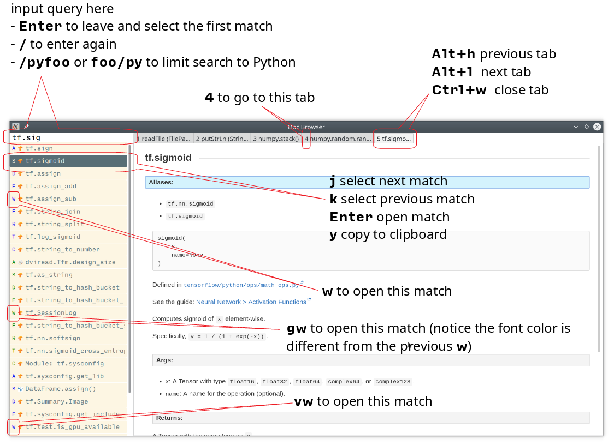

# Doc Browser

An API documentation browser written in Haskell and QML.


## Screenshot



[This one](asset/interface-hoogle.png) is the interface for Hoogle.

More shortcuts available: [commands](#commands), [keyboard shortcuts](#keyboard).

## Credits

This application is written by incomplete@aixon.co.

Many thanks to [Thibaut Courouble](https://github.com/Thibaut) and [other contributors](https://github.com/Thibaut/devdocs/graphs/contributors) of [DevDocs](https://github.com/Thibaut/devdocs), without their work, this application wouldn't be possible:

- This application ships with icons collected by DevDocs.

- This application uses docsets, along with the corresponding style sheets, produced by DevDocs.

Many thanks to [Neil Mitchell](https://github.com/ndmitchell) for the great [Hoogle](https://github.com/ndmitchell/hoogle). The Hoogle support receives [helps](https://github.com/qwfy/doc-browser/issues/2) from him. This application also ships with a little code from the Hoogle project, the modified code is licensed under the BSD license.

For Hoogle support, this application guides user to download documentation archive from [Stackage](https://www.stackage.org).


## Implemented Features

- Native desktop application

- Works offline

- Near real-time fuzzy search

- Easy-to-type shortcuts

- Hoogle integration


## Planned (in no particular order)

- Persistent tabs across application restarts

- Docsets management

- DBus interface

- Configurable


## Current Status

It's in early stage, the main interface is in shape and usable, but other aspects, like installing docsets and configuration, lack polishing. That being said, I use this application every day.


## Installation

First, install the font [Input Mono](http://input.fontbureau.com/), it is free for personal use. (In a later version you can specify the font you want to use)

Then, install the Haskell tool [stack](https://docs.haskellstack.org/en/stable/install_and_upgrade/).

### Arch Linux

There is a [PKGBUILD](https://aur.archlinux.org/packages/doc-browser/) available on AUR.

### Other Linux Distros

Follow these steps to install from source:

1. This application uses [Qt 5](http://qt-project.org/), make sure you have it installed. You also need [Qt WebEngine](https://wiki.qt.io/QtWebEngine), install it if it doesn't come with your Qt installation, on Arch Linux, this is provided by the [extra/qt5-webengine](https://www.archlinux.org/packages/extra/x86_64/qt5-webengine/) package.

2. The build process depends on an executable called `c2hs`, you can install it using your package manager, or use the instruction below.

3. Install the executables `alex` and `happy` in a similar manner with `c2hs`.

Finally, run these commands in the shell to build and install the application:

``` bash
git clone 'https://github.com/qwfy/doc-browser.git'
cd doc-browser

# optionally, install `c2hs` if not already installed:
# stack install c2hs

stack install

echo "binary installed to $(stack path --local-bin)"
```

Note, due to a restriction of stack, you shouldn't delete the `.stack-work` directory inside the source code directory you just cloned after the build, for the installed binary still need to access files in it. If you really don't want to depends on this `.stack-wrok` directory, you can copy the `ui` directory of this repository to somewhere, say `/foo/ui`, and then start this application with `doc_browser_datadir=/foo doc-browser` instead of the usual `doc-browser`. This annoying situation will be handled when this application gets a packaging system for various operating systems.

If you have trouble building this application, you can:

- Is it a dependency problem?
- Does [this page](http://www.gekkou.co.uk/software/hsqml/) help? Especially the _Requirements_ and _Installation_ section.
- Open an issue.

Optionally, install the executable `xsel` or `xclip` for the <kbd>Y</kbd> shortcut (copy the selected match to clipboard) to work.

Optionally, install the executable `xdg-open` (provided by package `xdg-utils` on Arch Linux) for the <kbd>Ctrl</kbd>+<kbd>/</kbd> shortcut (send query to Google) to work.

### Install DevDocs' Docset
To install DevDocs' docset, invoke:

```bash
doc-browser --install-devdocs DOC1 DOC2
# e.g. doc-browser --install-devdocs python haskell
```

This will download docsets from devdocs.io, and unpack them to `XDG_CONFIG/doc-browser/DevDocs`.

### Enable Hoogle Support

To support Hoogle, this application creates a Hoogle database from a documentation archive, which can be done by these steps:

1. Find out which documentation archive you want to use. The Hoogle support is tested on archives provided by [Stackage](https://www.stackage.org), like [this one](https://s3.amazonaws.com/haddock.stackage.org/lts-10.8/bundle.tar.xz), which can be found at: [https://www.stackage.org/lts-10.8](https://www.stackage.org/lts-10.8). You can use other archives as well, as long as the unpacked archive can be read by `hoogle generate --local=dir_to_unpacked_archive`, but this is untested.

2. Invoke the following installation command, this will unpack the archive to `XDG_CONFIG/doc-browser/Hoogle/NAME`, and creates a Hoogle database `XDG_CONFIG/doc-browser/Hoogle/NAME.hoo` for it, (doc-browser's Hoogle doesn't interfere with your system Hoogle in any way):

```bash
doc-browser --install-hoogle URL NAME
# e.g. doc-browser --install-hoogle 'https://s3.amazonaws.com/haddock.stackage.org/lts-10.8/bundle.tar.xz' lts-10.8
#
# URL is where to read the archive.
# It can also be a local file,
# which I suggest you to use if you have a bad network connection,
# since the download function included in this program is pretty savage at this stage.
#
# NAME shouldn't contain "/".
#
# See `doc-browser --help` for more
#
# Don't panic if you see a lot of lines that look like this
# at the begining and the ending of the generation
# (for the above lts-10.8, there are 43 of these):
#
# temporarily relocate x to x.__co.aixon.docbrowser-tempfile__, for x in:
# /home/user/.config/doc-browser/Hoogle/lts-10.8/prologue.txt
# ...
# move x.__co.aixon.docbrowser-tempfile__ back to x, for x in:
# /home/user/.config/doc-browser/Hoogle/lts-10.8/prologue.txt
# ...
#
# These are necessary to work around a Hoogle issue.
```

3. Prefix or suffix a search with "/hh" to query Hoogle, like this: `/hh[a]->Int->[a]`.

### Start the Application

```bash
doc-browser
```

### Offline Support

The documentation files themselves are downloaded to your disk when `doc-browser --install-devdocs` or `doc-browser --install-hoogle` is invoked, however, to display the documentation, some additional Cascading Style Sh\*t or JavaScript files are needed, some of these are not packaged with the documentation files.


To make DevDocs' docsets work fully offline:

- Start the application after `doc-browser --install-devdocs`

- Search for anything, and open any match

- When the tab is opened and the documentation is correctly displayed, all necessary files are cached, DevDocs' docsets work offline now

(Cache-when-installing will be implemented after session restore is implemented.)

Theoretically, the Hoogle documentations don't work fully offline yet, but in practice, most of the pages work just fine even when you are offline. (You can also try to open a Hoogle page when you are online, this might let the QtWebEngine cache kick-in, but this is untested)


## GUI

- When the application starts, you will see a blank screen, you can start typing to search.

- Prefix or suffix a search string with "/py", (e.g. "/pyabspath", "abspath/py"), will limit the search to the Python docset provided by DevDocs, more commands are available, see below.

- Number of tabs will peak at 10, open one more tab will close the left-most one.

- Various keyboard shortcuts are available, see below.


### Commands

Command | Effect
------- | ------
hs      | Limit search to Haskell
py      | Limit search to Python
tf      | Limit search to TensorFlow
np      | Limit search to NumPy
pd      | Limit search to pandas
er      | Limit search to Erlang
mp      | Limit search to Matplotlib
hh      | Perform search with Hoogle


### Keyboard

Key                                             | Effect                                | Comment
----------------------------------------------- | ------------------------------------- | ------
<kbd>/</kbd>                                    |focus the search box
<kbd>Ctrl</kbd>+<kbd>I</kbd>                    |focus and clear the search box, but keep the command, if any | e.g. before: "/pyfoo"; after: "/py"
<kbd>Enter</kbd>                                |accept query and select the first match|when in the search box
<kbd>A</kbd><kbd>S</kbd><kbd>D</kbd><kbd>F</kbd><kbd>W</kbd><kbd>E</kbd><kbd>R</kbd><kbd>T</kbd><kbd>C</kbd>             |open match 1-9
<kbd>G</kbd>+<kbd>A</kbd><kbd>S</kbd><kbd>D</kbd><kbd>F</kbd><kbd>W</kbd><kbd>E</kbd><kbd>R</kbd><kbd>T</kbd><kbd>C</kbd>|open match 10-18
<kbd>V</kbd>+<kbd>A</kbd><kbd>S</kbd><kbd>D</kbd><kbd>F</kbd><kbd>W</kbd><kbd>E</kbd><kbd>R</kbd><kbd>T</kbd><kbd>C</kbd>|open match 19-27
<kbd>J</kbd>                                    |select the next match
<kbd>K</kbd>                                    |select the previous match
<kbd>Enter</kbd>                                |open the selected match  |when the selected item has focus
<kbd>Tab</kbd> or <kbd>Down</kbd>               |select the next match    |when the selected item has focus
<kbd>Shift</kbd>+<kbd>Tab</kbd> or <kbd>Up</kbd>|select the previous match|when the selected item has focus
<kbd>1</kbd><kbd>2</kbd><kbd>3</kbd><kbd>4</kbd><kbd>5</kbd><kbd>6</kbd><kbd>7</kbd><kbd>8</kbd><kbd>9</kbd><kbd>0</kbd> | go to the corresponding tab
<kbd>Alt</kbd>+<kbd>L</kbd> |go to the next tab
<kbd>Alt</kbd>+<kbd>H</kbd> |go to the previous tab
<kbd>Ctrl</kbd>+<kbd>W</kbd>|close the current tab
<kbd>Y</kbd>|copy the selected match to clipboard|need executable `xsel` or `xclip`
<kbd>Ctrl</kbd>+<kbd>/</kbd>|send query to Google|e.g. <kbd>Ctrl</kbd>+<kbd>/</kbd> on "/pyfoo" will search Google for "Python foo"; need executable `xdg-open`


## FAQ and Troubleshooting

Problem: On KDE, <kbd>Ctrl</kbd>+<kbd>/</kbd> is taking too long to open the browser.

Solution: This application uses `xdg-open` to open the browser. Try [this workaround](https://bugs.kde.org/show_bug.cgi?id=364662#c3).


Q: Why does this application display at most 27 matches?

A: If your desired match is not in the top 27 matches, then there is probably something wrong with the search algorithm.


Q: Why does this application display at most 10 tabs?

A: If too many tabs are displayed, the tab title would be hard to see on many monitors. Instead of wanting more tabs, try open another instance of this application. (There is a restriction if you want to use multiple instances, namely, you should not close the first started one, for the documentation is served via a web server running in the first instance. This restriction will be removed in future versions). The number of maximum tabs will be configurable in future versions, so you can benefit from a large monitor.
